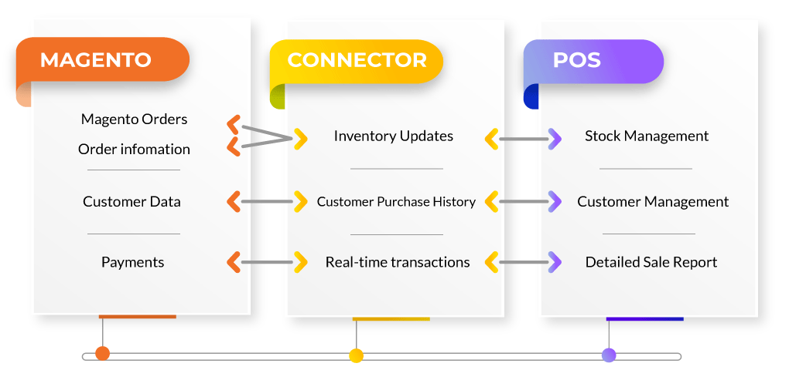
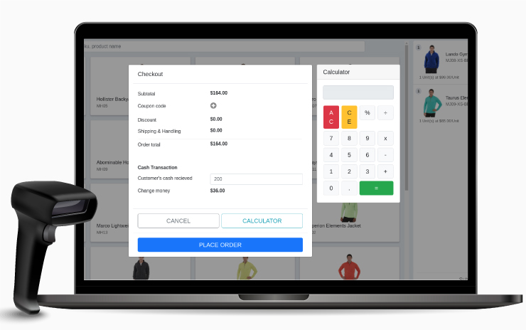
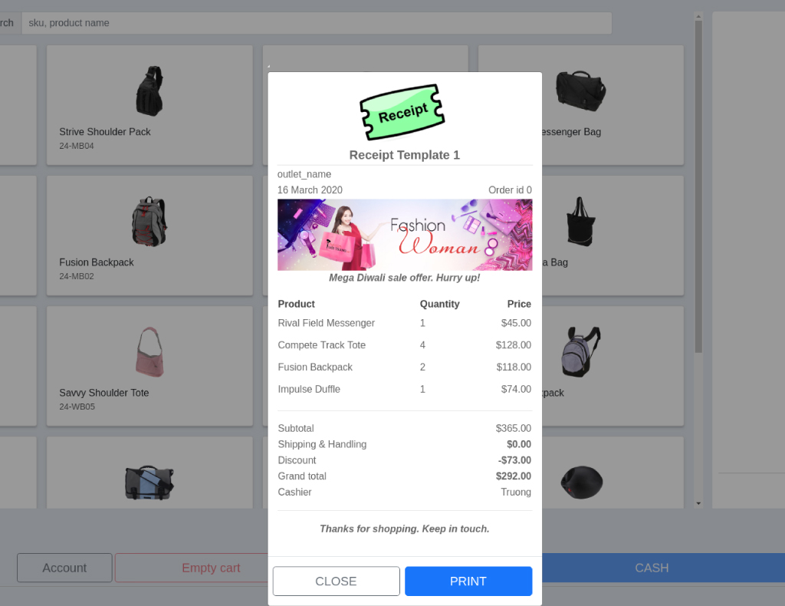
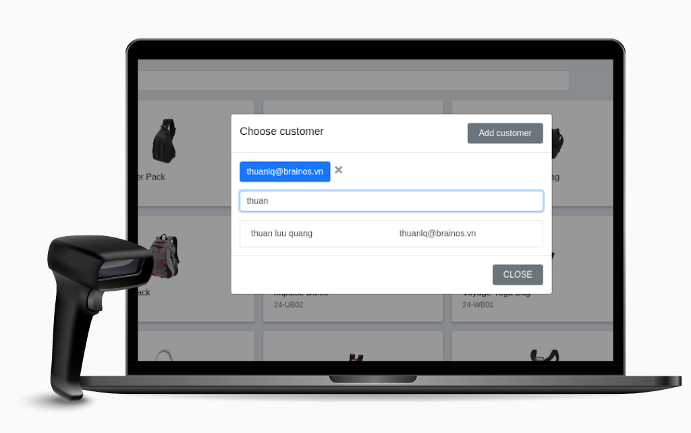
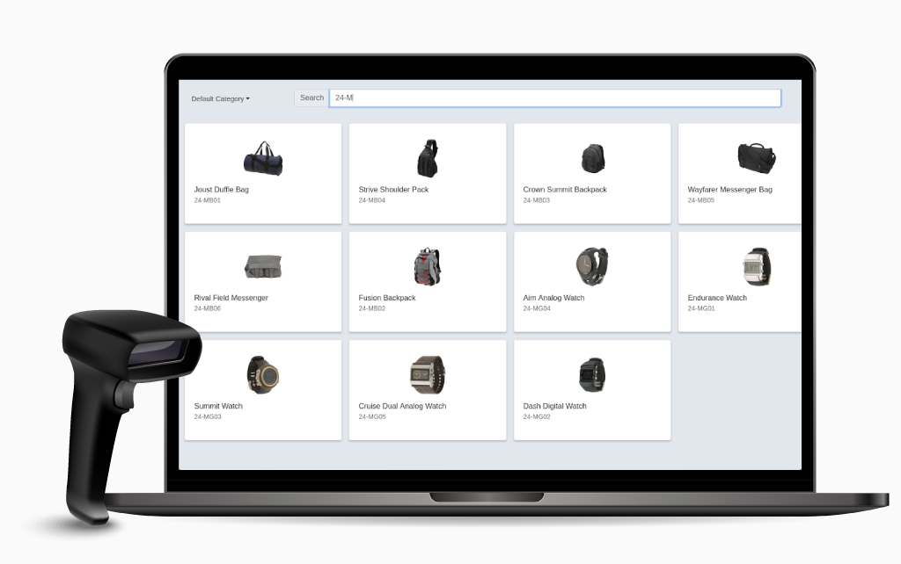
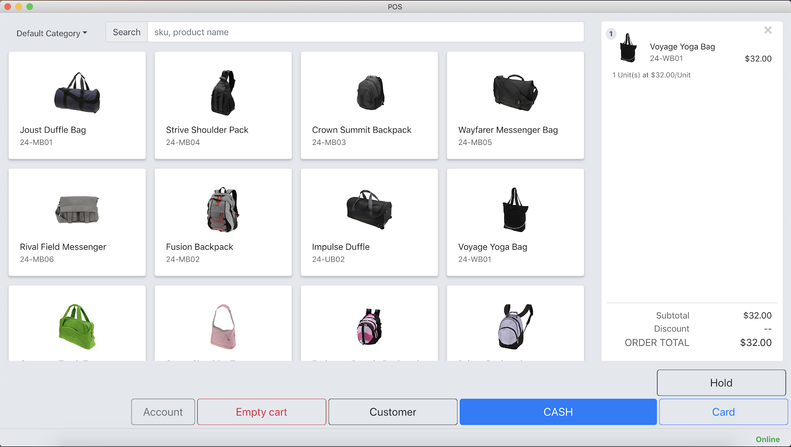

# Lof_POS Magento

This is a project base on Electron (a cross-platform desktop app with Javascript), use Magento 2 as backend manage products, orders, customers, checkout.
However at now our team are not having more time to complete the project, so we published source code for contributers and we will back to develop when we have time.

## Concept
We want to make a cross-platform POS frontend application for multi ecommerce Platform (Magento 2, Prestashop, Woocommerce,..)
- We developed POS frontend app with Reactjs, Electron (we just published source code)
- Backend we are using Magento 2 with some extensions support extra REST API, use magento 2 backend REST APIs (we published all modules repo)
- Between POS app and Magento 2 backend we are using API Gateway with Nodejs, Mongodb, NestJS (it is simply and we will public source code then)

## How it work



## DEMO POS APP

[View NestPos App for Magento 2](https://www.youtube.com/watch?v=TD1OHNjuSt8)

## Installation Environment

### For Linux System

#### Required install node ~12.x

```bash
sudo apt-get install curl
curl -sL https://deb.nodesource.com/setup_12.x | sudo -E bash -
sudo apt-get install nodejs
```


#### Required install yarn 1.2x.x

```bash
curl -sS https://dl.yarnpkg.com/debian/pubkey.gpg | sudo apt-key add -
echo "deb https://dl.yarnpkg.com/debian/ stable main" | sudo tee /etc/apt/sources.list.d/yarn.list
sudo apt update && sudo apt install yarn
```
### For Window System
#### Required Node 12.x download
[Node 12.x download](https://nodejs.org/dist/latest-v12.x/win-x64/node.exe)

#### Required Yarn 1.2x.x download
[Yarn 1.2x.x download](https://classic.yarnpkg.com/latest.msi)

### For MacOS System
#### Required Node 12.x download
[Node 12.x download](https://nodejs.org/dist/latest-v12.x/node-v12.20.0.pkg)

#### Required Yarn 1.2x.x download

#### Required Setup Magento 2 site and setup list extesion for management and REST API

- [Magento 2 POS App Settings Module](https://github.com/landofcoder/module-pos-pos-setting)
- [Magento 2 POS Receipt](https://github.com/landofcoder/module-pos-receipt)
- [Magento 2 SYC Products, Orders](https://github.com/landofcoder/module-pos-pos-sync)
- [Magento 2 Cashier](https://github.com/landofcoder/module-pos-cashier)
- [Magento 2 Outlet](https://github.com/landofcoder/module-pos-outlet)
- [Magento 2 Add Custom Product](https://github.com/landofcoder/module-pos-custom-product)
- [Magento 2 POS Permission](https://github.com/landofcoder/module-pos-permission)
- [Magento 2 Barcode Inventory](https://github.com/landofcoder/module-pos-barcode-inventory)
- [Magento 2 Multi Barcode](https://github.com/landofcoder/module-pos-multi-barcode)
- [Magento 2 Barcode Warehouse Integration](https://github.com/landofcoder/module-pos-barcode-warehouse-integration)
- [Magento 2 Barcode Label](https://github.com/landofcoder/module-pos-barcode-label)


##### Installed homebrew first

```bash
/bin/bash -c "$(curl -fsSL https://raw.githubusercontent.com/Homebrew/install/HEAD/install.sh)
```
after that
```bash
brew install yarn
```


## Check Environment

Check node version 
```bash
node -v 
```
Check yarn version 
```bash
yarn -v 
```


## Develop Lof_POS app 

#### Install node packages first
```bash
yarn install
```

#### Run develop app

```bash
yarn dev
```

## Production Lof_POS app

### Run bundler for POS to package

#### For custom build platform

For window
```bash
yarn package-win
```

For linux
```bash
yarn package-linux
```


#### Note: For the bundle for macOS (macOS machine required)
 
#### Bundle all package file supported (macOS, linux, windows)
```bash
yarn package-all
``` 
#### That takes a long time


### With success all package stored at 

```bash
/release
*.exe(windows)
*.deb(linux)
*.dmg(macOS)
```


## Lof_POS license 
[Landofcoder license](https://landofcoder.com/license)

# Screenshots

<h3>POS Cash Payment</h3>


<h3>POS Custom Receipt</h3>


<h3>POS Choose Customer</h3>


<h3>POS Search by Sku</h3>


<h3>POS Dashboard</h3>


## Donation

If this project help you reduce time to develop, you can give me a cup of coffee :) 

[](https://www.paypal.com/paypalme/allorderdesk)
